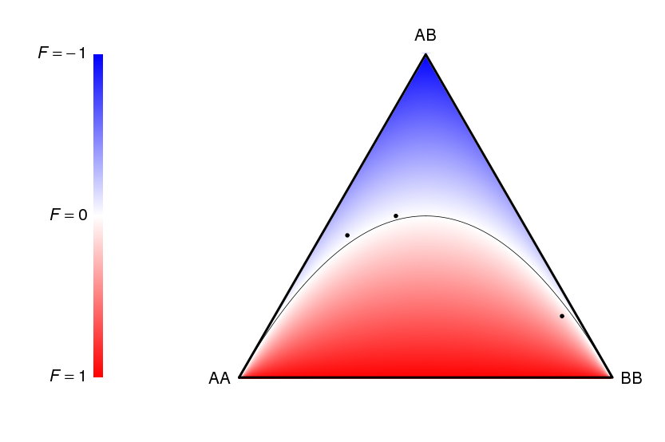

# deFinetti [](https://travis-ci.org/mkanai/deFinetti)
A package for plotting a [de Finetti diagram](http://en.wikipedia.org/wiki/De_Finetti_diagram) and distributions of [F-statistics](http://en.wikipedia.org/wiki/F-statistics) of genotypes.

## Installation
```{r}
library(devtools)
install_github("mkanai/deFinetti")
```

## Usage
```{r}
> library(deFinetti)
> data(GenotypeFreq)
> GenotypeFreq
    AA   AB   BB
1 0.33 0.50 0.17
2 0.49 0.44 0.07
3 0.04 0.19 0.77
> deFinetti.plot(GenotypeFreq, with_F_color = TRUE)
```



## Notes
* The original R script was written by Kenji Yamane. This package extends the functionality of his script, giving the capability to plot the diagram and legend at the same time, an example dataset, and documentations.

